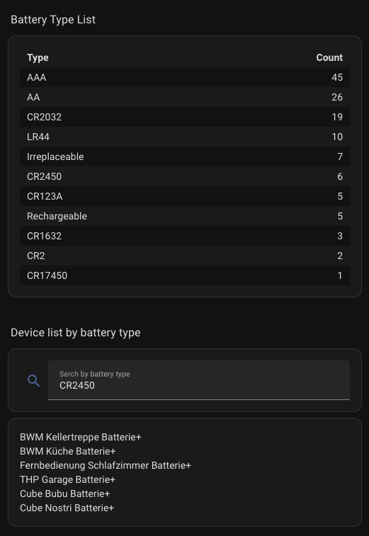

# Community Contributions

## Dashboards

### Battery State Card

Using the excellent [Battery State Card](https://github.com/maxwroc/battery-state-card) by maxwroc you can easily display devices with their batteries required where the devices battery threshold indicates it's low and show be replaced.

```yaml
type: custom:battery-state-card
secondary_info: "{attributes.battery_type_and_quantity}"
round: 0
filter:
  include:
    - name: entity_id
      value: "*_battery_plus"
  exclude:
    - name: attributes.battery_low
      value: false
bulk_rename:
  - from: "Battery+"
sort:
  - state
```

### Get a markdown summary of your battery quantities

This is from the excellent German blog [Smart Live](https://smart-live.net/battery-notes-batteriemanagement-mit-home-assistant/)  
The overview video is available on YouTube [here](https://youtu.be/D403Vy2VaFA)

```yaml


 
 
 
 
 
 
 
 
 
 
 
 
 
  | Type | Count |
| :-- | --: |

 | {{ bt[0] }} | {{ [bt][0][1] }} |

```

### Search for devices with a particular battery

Again from the excellent [Smart Live](https://smart-live.net/battery-notes-batteriemanagement-mit-home-assistant/)  
This requires creating a helper of type text called `Battery search` with a max length of 20, which you can then reference in the below yaml on a dashboard.

```yaml
type: vertical-stack
cards:
  - type: entities
    entities:
      - entity: input_text.battery_search
        name: Search by battery type
        icon: mdi:magnify
        secondary_info: none
    state_color: false
  - type: markdown
    content: |-
      
           
        
        
          
        
            
        
        
          {{ matching_devices | join('\n') }}
        
          No devices with such battery type
        
      
        Search result
      
```



## Automations

### Battery Low Notification

Raise a persistent notification when a battery is low, dismiss when it's not low

!!! note

    Battery Threshold events are only raised when the device has a Battery+ entity or a [Battery Low Template](./index.md/#battery-low-template) is added to the Battery Notes configuration.

```yaml
alias: Battery Low Notification
description: Battery Low Notification with auto dismiss
mode: queued
triggers:
  - trigger: event
    event_type: battery_notes_battery_threshold
    event_data:
      battery_low: true
    id: low
    alias: Battery went low
  - trigger: event
    event_type: battery_notes_battery_threshold
    event_data:
      battery_low: false
    id: high
    alias: Battery went high
conditions: []
actions:
  - choose:
      - conditions:
          - condition: trigger
            id:
              - low
        sequence:
          - action: persistent_notification.create
            data:
              title: |
                {{ trigger.event.data.device_name }} Battery Low
              notification_id: "{{ trigger.event.data.device_id }}-{{ trigger.event.data.source_entity_id }}"
              message: >
                The device has a battery level of {{
                trigger.event.data.battery_level }}% {{ '\n' -}} You need {{
                trigger.event.data.battery_quantity }}× {{
                trigger.event.data.battery_type }}
      - conditions:
          - condition: trigger
            id:
              - high
        sequence:
          - action: persistent_notification.dismiss
            data:
              notification_id: "{{ trigger.event.data.device_id }}-{{ trigger.event.data.source_entity_id }}"
```

### Check Battery Low daily reminder

Call the check battery low action every day to raise events for those that are still low.  
To be used in conjunction with a [Battery Low Notification](community.md/#battery-low-notification) or similar.

```yaml
alias: Daily Battery Low Check
description: Check whether a battery is low
mode: single
triggers:
  - trigger: time
    at: "09:00:00"
conditions: []
actions:
  - action: battery_notes.check_battery_low
```

### Check Battery Low weekly reminder

Weekly reminders are a little trickier, you will need to create a [Schedule Helper](https://www.home-assistant.io/integrations/schedule/) for when you want the battery check to occur then use this automation for when the helper is on.  
Below I am referencing a schedule helper called maintenance which I have set to come on weekly.  
To be used in conjunction with a [Battery Low Notification](community.md/#battery-low-notification) or similar.

```yaml
alias: Battery Low Check
description: Check whether a battery is low
mode: single
triggers:
  - trigger: state
    entity_id:
      - schedule.maintenance
    to: "on"
conditions: []
actions:
  - action: battery_notes.check_battery_low
    data: {}
```

### Battery Replaced

Mark a battery as replaced when there is an increase in battery level.

!!! note

    Battery Increased events are only raised when the device has a Battery+ entity or a [Battery Low Template](./index.md/#battery-low-template) is added to the Battery Notes configuration.

```yaml
alias: Battery Replaced
description: Battery Replaced
mode: queued
triggers:
  - trigger: event
    event_type: battery_notes_battery_increased
conditions: []
actions:
  - action: battery_notes.set_battery_replaced
    data:
      device_id: "{{ trigger.event.data.device_id }}"
      source_entity_id: "{{ trigger.event.data.source_entity_id }}"
```

Send a notification when there is an increase in battery level.

```yaml
alias: Battery Increased Notification
description: Battery Increased Notification
mode: queued
triggers:
  - trigger: event
    event_type: battery_notes_battery_increased
conditions: []
actions:
  - action: persistent_notification.create
    data:
      title: |
        {{ trigger.event.data.device_name }} Battery Increased
      message: >
        The device has increased its battery level, you probably want to mark it as replaced
```

### Check Battery Last Reported Daily

Call the check battery last reported action every day to raise events for those not reported in the last two days.  
To be used in conjunction with a Battery Not Reported automation.

```yaml
alias: Daily Battery Not Reported Check
description: Check whether a battery has reported
mode: single
triggers:
  - platform: time
    at: "09:00:00"
conditions: []
actions:
  - action: battery_notes.check_battery_last_reported
    data:
      days_last_reported: 2
```

### Battery Not Reported

Respond to events raised by the check_battery_last_reported action and create notifications.

!!! info

    Note this cannot be run manually as it examines event triggers, use it with the [Check Battery Last Reported Daily](community.md/#check-battery-last-reported-daily) or similar.

```yaml
alias: Battery Not Reported
description: Battery not reported
mode: queued
max: 30
triggers:
  - trigger: event
    event_type: battery_notes_battery_not_reported
conditions: []
actions:
  - action: persistent_notification.create
    data:
      title: |
        {{ trigger.event.data.device_name }} Battery Not Reported
      message: >
        The device has not reported its battery level for {{
        trigger.event.data.battery_last_reported_days }} days {{ '\n'
        -}} Its last reported level was {{
        trigger.event.data.battery_last_reported_level }}% {{ '\n' -}} You need
        {{ trigger.event.data.battery_quantity }}× {{
        trigger.event.data.battery_type }}
```

## Automation Tips

To call the battery replaced action from an entity trigger you will need the device_id, here's an easy way to get this

```yaml
actions:
  - action: battery_notes.set_battery_replaced
    data:
      device_id: "{{ device_id(trigger.entity_id) }}"
```

## Blueprints

A collection of Blueprints are available [here](./blueprints.md).

## Contributing

If you want to contribute then [fork the repository](https://github.com/andrew-codechimp/HA-Battery-Notes), edit this page which is in the docs folder and submit a pull request.
