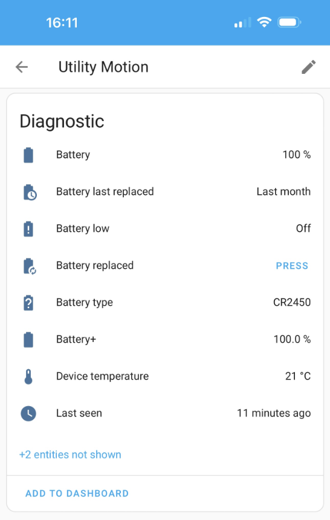
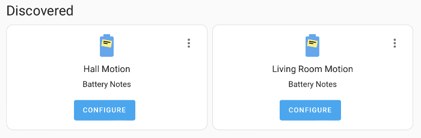

# Battery Notes for Home Assistant

Integration to add battery notes to a device or entity, with automatic discovery via a growing [battery library](library.md) for devices.  
Track the battery type, when the battery was replaced, when a battery is low based on device or global thresholds and also when a battery hasn't been reported for a while.

**Dashboard cards usage**

A battery+ sensor provides useful attributes for easy use in dashboards, the standard battery can optionally be hidden.

**Notifications and automations**

Battery low, replaced and not reported are all exposed via events and actions, using these you can create your own automations to generate notifications or other actions, there are some predefined ones in [community](https://andrew-codechimp.github.io/HA-Battery-Notes/community).

_Please :star: this repo on [GitHub](https://github.com/andrew-codechimp/HA-Battery-Notes) if you find it useful_  
_If you want to show your support please_

[](https://www.buymeacoffee.com/codechimp)

## Features

The integration will add additional diagnostic entities to your device.



- [Entities](./entities.md)
- [Actions](./actions.md)
- [Events](./events.md)

## How to use Battery Notes

Once you have [installed the integration](https://github.com/andrew-codechimp/HA-Battery-Notes#installation) you will hopefully have some devices discovered and you can follow the Notification to confirm their details and add them, if you don't have devices discovered you can add them manually.



## To add a battery note manually

- Go to Settings/Integrations/Battery Notes and click Add Battery Note.
- Choose Device or Entity and click next. Device will automatically detect a battery and will work for most common devices, you should use entity if your device has multiple batteries or when an entity does not have a device.
- Choose your device or entity from the drop down and click next.
- Enter the battery type and quantity and optionally a battery low threshold and click submit.

!!! info

    The library is updated automatically with new devices approximately every 24 hours from starting Home Assistant, if you have added a device to the library using [this form](https://github.com/andrew-codechimp/HA-Battery-Notes/issues/new?template=new_device_request.yaml&title=[Device]%3A+) then this will take about a day to be discovered once it's approved and added.

## Battery Percentage Template

This is for advanced use where a device does not have a typical battery percentage (or it is innacurate) but still provides an indication of the level, such as a string, boolean or voltage.  
Specifying a template for devices without a typical battery percentage will create a battery+ sensor.  
You can specify a template that must return a percentage (0-100).

Example of voltage sensor with a maximum capacity of 3 volts, with a linear percentage (3 volts = 100%, 0 volts = 0%)   
```{{ (states('sensor.my_sensor_voltage')|float(0) / 3 * 100) | round(0) }}```  

Example of voltage sensor with a maximum capacity of 3 volts, where 2 volts should be equivalent to 10%  
```{{ [0, (((states('sensor.voltage')|float(0) - 2) / (3 - 2)) * 90 + 10) | round(0)] | max }}```

Example of binary low sensor, returning either 100% or 9%  
```{{ 9 if states('binary_sensor.my_sensor_low') == true else 100 }}```  

## Battery Low Template

This is for advanced use where a device does not have a typical battery percentage or battery low boolean (or it is innacurate) but still provides an indication of the level, such as a string, boolean or voltage.  
The battery percentage template above will also trigger low battery events/states so the battery low template is for legacy use.  
You can specify a template that must return true when the battery is deemed low.  

Example templates

```
{{ states('sensor.mysensor_battery_low') }}
{{ states('sensor.mysensor_battery_level') == "Low" }}
{{ states('sensor.mysensor_battery_voltage') | float(5) < 1 }}
```

!!! info

    If a template is specified then the battery percentage will be ignored when evaluating threshold and increased events.

## Filter Outliers

This is for advanced use when a device occasionally erroneously reports a very low battery level before going back to its true value, which causes battery low events to be raised.  
If you switch this on for a device then that devices battery low events will be delayed until it has three consistently low states.

## Community Contributions

A collection of community contributions can be found on the [community contributions](./community.md) page.

## FAQ

Before raising anything, please read through the [faq](./faq.md). If you have questions, then you can raise a [discussion](https://github.com/andrew-codechimp/HA-Battery-Notes/discussions). If you have found a bug or have a feature request please [raise it](https://github.com/andrew-codechimp/HA-Battery-Notes/issues) using the appropriate report template.
