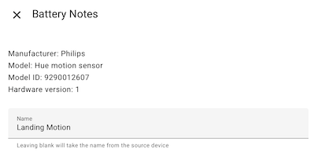

# Library

The library contains user contributed device definitions to allow discovery of the most popular devices.  
The library is updated when Home Assistant is restarted and approximately every 24 hours after that.  
It will pull the latest devices that have been merged into the main branch, if you have recently submitted a pull request for a new device it will not appear until it has been manually reviewed and merged.

# Contributing to the library

## Submit Definition via GitHub Issues Form

[](https://github.com/andrew-codechimp/HA-Battery-Notes/issues/new?template=new_device_request.yml&title=[Device]%3A+)

Upon submission using the form above GitHub will attempt to make the required code changes automatically.

## Submit Definition via Pull Request

Fork the repository, add your device details to the JSON document `library/library.json`, and then submit a pull request. Do not enable GitHub Actions (disabled by default) as this will mess with the pull request and are unnecessary for a library submission.

* The easiest way to get the correct device information is to add the device manually, on the battery type panel you will see a summary at the top of the details required to add to the library.  This is also available if you go into configure of the device in battery notes.
* The manufacturer and model should be exactly what is displayed on the Device screen within Home Assistant. If the Device screen has a Model ID or Hardware Version then this should be included.
* In some rare cases models could contain unique identifiers and you want the battery type to apply to all models that match a pattern, in these instances you can use the optional model_match_method attribute.  For example Apple iPhone's have a model of iPhoneXX.X but all have a rechargeable battery, here you could use the "model_match_method": "startswith" and just specify iPhone as the model.
* The manufacturer & model names may be different between integrations such as Zigbee2MQTT and ZHA, if you see a similar device please duplicate the entry rather than changing it.
* The `battery_quantity` data is numeric (no quotes) and optional. If a device only requires a single battery, it should be omitted.
* The `battery_type` data should follow the most common naming for general batteries (ex. AAA, D) and the IEC naming for battery cells according to [Wikipedia](https://en.wikipedia.org/wiki/List_of_battery_sizes) (ex. CR2032, 18650)
* If a device has a bespoke rechargeable battery you can use `"battery_type": "Rechargeable"`
* For devices like smoke alarms where the battery is not replaceable you can use `"battery_type": "Irreplaceable"`
* If a device shouldn't be discovered because there are multiple revisions with the same model number but different battery types it can be added to the library with a `"battery_type": "MANUAL"` to note it is a device that shouldn't have a battery definition added to the library to save removal/re-add because people don't realise there are variants.

For the example image below, your JSON entry will look like this:

```
{
    "manufacturer": "Philips",
    "model": "Hue motion sensor",
    "model_id": "9290012607", < Optional, only add it if your device shows it.
    "hw_version": "Some specific hardware detail", < Optional, only add it if your device shows it.
    "battery_type": "AAA",
    "battery_quantity": 2,  < Only use if more than 1 battery
    "model_match_method": "startswith|endswith|contains" < Only use if you are creating a model with unique identifier (ex. trailing serial numbers)
},
```


